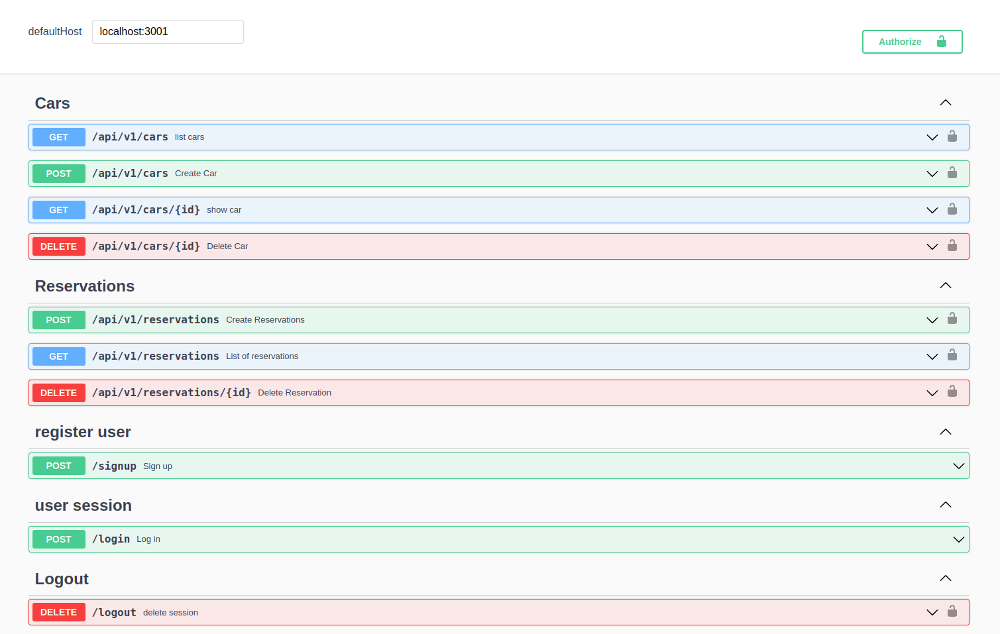

# Rent A Car

<div id="top"></div>
<!-- PROJECT LOGO -->
<div align="center">
  <a href="https://github.com/VuDej/final-capstone-back-end">
    
  </a>

  <h1 align="center">Rent A Car -rails</h1>

  <p align="center">
    A car rental website
    <br />

## Frontend Repository Link
<a href="https://github.com/Gegardus/book-a-car-frontend">Book A Car Frontend</a>

  <a href="https://github.com/VuDej/final-capstone-back-end#readme"><strong>Explore the docs »</strong></a>
    <br />
    <br />
    <a href="https://final-capstone-back.herokuapp.com/index.html">View Demo</a>
    ·
    <a href="https://github.com/VuDej/final-capstone-back-end/issues">Report Bug</a>
    ·
    <a href="https://github.com/VuDej/final-capstone-back-end/issues">Request Feature</a>
  </p>
</div>

<!-- TABLE OF CONTENTS -->
<details>
<summary align="center">Table of Contents</summary>

- [Rent A Car](#rent-a-car)
  - [Frontend Repository Link](#frontend-repository-link)
  - [Screenshots](#screenshots)
  - [Description 🏗️](#description-️)
  - [Live Demo](#live-demo)
  - [Getting Started 🏁](#getting-started-)
    - [Prerequisites and Dependencies 📜](#prerequisites-and-dependencies-)
      - [Setting Up PostgreSQL](#setting-up-postgresql)
    - [Clone this repository](#clone-this-repository)
    - [Move into the cloned directory with](#move-into-the-cloned-directory-with)
  - [Setup](#setup)
    - [Run linter](#run-linter)
      - [Auto-correct](#auto-correct)
    - [Run Project](#run-project)
  - [Run tests](#run-tests)
    - [Roadmap](#roadmap)
  - [Built With 🔨](#built-with-)
  - [Authors ✍️](#authors-️)
  - [🤝 Contributors](#-contributors)
  - [📝 License](#-license)
  - [Show your support 💪](#show-your-support-)
  - [Acknowledgments](#acknowledgments)
</details>

<!-- About the project -->
[App screenshot](https://example.com)

##  Screenshots


## Description 🏗️
This is a car rental website that allows you to view  a variety of cars and book them at different rates.

<p align="right">(<a href="#top">back to top</a>)</p>

## Live Demo

(In progress)

## Getting Started 🏁

### Prerequisites and Dependencies 📜

You will be needing:

- A terminal terminal
- A code editor
- Ruby (follow the instructions based on your OS)
  ```bash
  https://www.ruby-lang.org/en/documentation/installation/
  ```
- Rails (follow the instructions based on your OS)
    ```bash
    https://guides.rubyonrails.org/getting_started.html#creating-a-new-rails-project-installing-rails
    ```

- Postgresql (follow the instructions based on your OS)
  ```bash
  https://www.postgresql.org/download/
  ```


#### Setting Up PostgreSQL

- The postgres installation doesn't setup a user for you, so you'll need to follow these steps to create a user with permission to create databases. You can skip this if this is not your first time using PostgreSQL

  ```bash
  sudo -u postgres createuser <Username> -s
  ```

### Clone this repository

```bash
git clone https://github.com/VuDej/final-capstone-back-end.git
```
### Move into the cloned directory with

  ```bash
  cd final-capstone-back-end
  ```

## Setup

Install gems with:

  ```bash
  bundle install
  ```

Setup the database with:
```bash
rails db:create
```
<div>OR</div>

```bash
rake db:create
```

### Run linter

```bash
rubocop .
```

#### Auto-correct

In auto-correct mode, RuboCop linters offenses will be automatically fixed:

For rubocop:
```bash
rubocop -A
```
 **<div>OR</div>**
```bash
rubocop --auto-correct-all
```

### Run Project

Start server with:

```bash
rails s
```
<div align="center">OR</div>

```bash
rails server -p 3001 
```
This will start a server at:
```bash
localhost:3001
```
You can paste or type it on url bar

## Run tests

Make sure you have installed gems with:

 ```bash
  bundle install
```
Then run all the tests with:

```bash
rspec spec
```

<p align="right">(<a href="#top">back to top</a>)</p>

<!-- ROADMAP -->
### Roadmap

- [x] Set up the repository/repositories on GitHub and use Gitflow.
- [x] Set up Postgres for the database
- [x] Create controllers, endpoints and models
- [x] Use Rails to create API.
- [x] Use React & Redux to create frontend UI.
- [x] Create unit tests
- [x] Create README
  
<p align="right">(<a href="#top">back to top</a>)</p>

## Built With 🔨
<div align="center">

|| Languages ||
|-|-------------|-|
||  ||

</div>

<div align="center">

||Tools 🛠️||
|-|-------------|-|
||       ||
<p align="right">(<a href="#top">back to top</a>)</p>
</div>

## Authors ✍️
<div align="center">

| 👤 vudej  |
|---|
| <a target="_blank" href="https://github.com/VuDej"></a>  <a target="_blank" href="https://www.linkedin.com/in/dejan-vujovic/"></a> <a target="_blank" href="https://twitter.com/DejanVuj"></a>
|


| 👤 Abdulfatai Badara  |
|---|
|<a target="_blank" href="https://github.com/fobadara"></a>  <a target="_blank" href="https://www.linkedin.com/in/fob90s"></a> <a target="_blank" href="https://twitter.com/fob90s"></a>  
<a target="_blank" href="mailto:fob90s@gmail.com"></a> <a target="_blank" href="https://wa.me/+2349066478370"> </a> 
(Click any of the badges to reach me. Especially whatsapp)|

| 👤 Vahan  |
|---|
| <a target="_blank" href="https://github.com/Gegardus"></a>  <a target="_blank" href="https://www.linkedin.com/in/vahan-khachvankian"></a> <a target="_blank" href="https://twitter.com/Gegardus"></a>
|

| 👤 Tresor Sawasawa |
|---|
| <a target="_blank" href="https://github.com/tresorsawasawa"></a>  <a target="_blank" href="https://www.linkedin.com/in/tresor-sawasawa/"></a> <a target="_blank" href="https://twitter.com/TresorSawasaw"></a>  
|

| 👤 francis  |
|---|
| <a target="_blank" href="https://github.com/githubhandle"></a>  <a target="_blank" href="https://linkedin.com/in/linkedinhandle"></a> <a target="_blank" href="https://twitter.com/twitterhandle"></a>  
|

</div>

<p align="right">(<a href="#top">back to top</a>)</p>


## 🤝 Contributors

Contributions, issues, and feature requests are greatly appreciated!

If you have a suggestion that would make this better, please fork the repo and create a pull request. You can also simply open an issue with the tag "improvements".

- Fork the Project
- Create your Feature Branch (git checkout -b feature/yourfeaturename)
- Commit your Changes (git commit -m 'Add suggested feature')
- Push to the Branch (git push origin feature/AmazingFeature)
- Open a Pull Request

Feel free to check the [issues page](https://github.com/VuDej/final-capstone-back-end/issues).

<p align="right">(<a href="#top">back to top</a>)</p>

## 📝 License

This project is licensed by [](LICENSE)

## Show your support 💪
Give a ⭐️ if you like this project!

## Acknowledgments

- Hat tip to [Murat Korkmaz](https://www.behance.net/gallery/26425031/Vespa-Responsive-Redesign/modules/173005583) for the design idea.

<p align="right">(<a href="#top">back to top</a>)</p>
